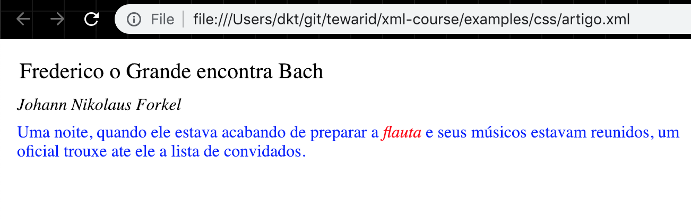

# Transformando XML – CSS

## Cascading Style Sheets (CSS)

- CSS significa Folhas de Estilo Em Cascata

- É utilizada com HTML

- Pode ser utilizada com XML

- Determina a formatação visual dos elementos

- Qualquer navegador com suporte a CSS pode formatar os elementos

  - IE 5.x ou superior

  - Netscape 6.x ou superior

- Padrão atualmente no nível 2 (CSS2)

## Exemplo de uso da CSS com XML

- Vamos abrir este documento XML em IE 5.0

  ```xml
  <?xml version="1.0" encoding="ISO-8859-1"?>
  <?XML:stylesheet type="text/css" href="artigo.css"?>
  <artigo>
    <titulo>Frederico o Grande encontra Bach</titulo>
    <autor>Johann Nikolaus Forkel</autor>
    <paragrafo>
      Uma noite, quando ele estava acabando de preparar a
      <instrumento>flauta</instrumento> e seus músicos estavam
      reunidos, um oficial trouxe a lista de convidados.
    </paragrafo>
  </artigo>
  ```

## Exemplo de uso de CSS - artigo.css

```css
instrumento { display: inline }
artigo, titulo, autor, paragrafo { display: block }
titulo { font-size: 1.3em }
autor { font-style: italic }
artigo, titulo, autor, paragrafo { margin: 0.5em }
instrumento { font-style: italic }
```



## Seletores

- Uma folha de estilo contém um conjunto de regras compostas de

  - Seletores

  - Blocos de declarações

- Um seletor especifica um ou mais elemento XML

- Exemplo

  ```css
  artigo, titulo, autor, paragrafo { display: block }
  ```

  - `artigo`, `titulo`, `autor` e `paragrafo` são seletores

  - A declaração CSS começa depois de `{` e termina com `}`

## Tipos de Seletores

- Seletor Universal

  ```css
  * { color: blue }
  ```

- Seletor de tipo

  ```css
  H1 { color: blue }
  ```

- Seletor de classe (válido somente para HTML)

  ```css
  p.titulo { color: red }
  ```

- Seletor de ID

  ```css
  H1#chapter1 { text-align: center }
  ```

## Mais Tipos de Seletores

- Seletor de descendente

  ```css
  paragrafo { color: blue }
  instrumento { color: blue; font-style: italic }
  paragrafo instrumento { color: red }
  ```

- Seletor de filho

  ```css
  BODY > P { line-height: 1.3 }
  ```

- Seletor de irmão adjacente

  ```css
  H1 + H2 { margin-top: -5mm }
  ```

- Seletor de atributos

  ```css
  *[LANG=fr] { display: none }
  ```

## Pseudo-elementos e Pseudo-Classes

- Pseudo-classes

  - `:first-child`, `:link`, `:visited`, `:hover`, `:active`, `:focus` e `:lang`

    ```css
    DIV > P:first-child { text-indent: 0 }
    A:link { color: red }
    A:focus { background: yellow }
    HTML:lang(fr) { quotes: '« ' ' »' }
    ```

- Pseudo-elementos

  - `:first-line`, `:first-letter`, `:before` e `:after`

    ```css
    P:first-line { text-transform: uppercase }
    P:first-letter { color: green; font-size: 200% }
    H1:before {content: counter(chapno, upper-roman) ". "}
    ```

## Valor das Propriedades

- Propriedades estão contidas dentro de um bloco de declaração

- Valores de alguns tipos básicos

- Comprimento

  - Um número seguido de uma unidade de medida como `em`, `px`, `cm` e `mm`

- Porcentagem

- Cor

  - Um valor hexadecimal, por exemplo, `#FFFFFF` é a cor branca
  
  - Uma especificação RGB explicita, por exemplo, `rgb(0, 0, 255)` ou `rgb(0%, 0%, 100%)`
  
  - Palavras chaves

- URL (para imagens)

## Propriedades da Caixa

- Os elementos são pintados dentro de uma caixa, retângulo por padrão

- Display

  - `display: block` cria um novo bloco contendo o texto do elemento

  - `display: inline` evita criar um novo bloco e mostra o texto dentro do bloco do elemento pai

  - `display: none` suprime o elemento

- Margem (externo à borda)

  - `margin-top`, `margin-right`, `margin-bottom` e `margin-left`, ou apenas `margin`

## Mais Propriedades da Caixa

- Borda

  - Tipo `none`, `dotted`, `dashed`, `solid`, `double`, `groove`, `ridge`, `inset`, ou `outset`, por exemplo, `border: solid, dotted, double, inset;`

  - Largura `border-top-width`, `border-right-width`, `border-bottom-width` e `border-left-width`, ou apenas `border-width`

- Padding (enchimento interno à borda)

  - `padding-top`, `padding-right`, `padding-bottom` e `padding-left`, ou apenas `padding`

## Propriedades de Texto e Fonte

- Nome da fonte - `font-family`

- Comprimento da fonte - `font-size`

- Estilo e peso - `font-style` e `font-weight`

- Alinhamento do Texto - `text-align` e `vertical-align`

- Endentação e Altura de Linha - `text-indent` e `line-height`

## Propriedades da Cor e Fundo

- Cor do primeiro plano - `color`

- Cor de fundo - `background-color`

- Cor da borda - `border-color`

- Imagem de fundo - `background-image`

## Importando uma Folha de Estilo

- Uma folha de estilo pode ser importada dentro da outra

- Regras especificadas no arquivo atual sobrepõem as regras do arquivo importado

- Utilizamos `@import` para fazer a importação

- Exemplo

  ```css
  @import url(http://www.w3.org/css/default.css);
  ```

## Exercício 6

- Crie um documento CSS para mostrar o catálogo de livros dentro do browser
