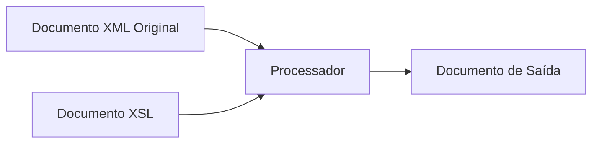

# Transformando XML – XSL

## eXtended Stylesheet Language

- CSS faz transformações básicas

- Queremos transformar

  - XML para XML

  - XML para HTML

  - Agrupar, filtrar, calcular e classificar

- Não estamos falando em deixar de usar a CSS

## Conceito de XSL

- O processo de usar XSLT

  - Ler documento XML

  - Aplicar Transformações

  - Gravar documento resultante



## Exemplo de XSLT - Documento Original

- Vamos aplicar transformações neste documento

  ```xml
  <?xml version="1.0" encoding="UTF-8"?>
  <?xml-stylesheet type="text/xsl" href="catalogo.xsl"?>
  <catalogo>
    <livros>
      <livro nome="Professional XML"/>
      <livro nome="XML By Example"/>
    </livros>
  </catalogo>
  ```

## Exemplo de XSLT

```xsl
<?xml version="1.0" encoding="UTF-8"?>
<xsl:stylesheet version="1.0" xmlns:xsl="http://www.w3.org/1999/XSL/Transform" xmlns:msxsl="urn:schemas-microsoft-com:xslt">
    <xsl:template match="/">
        <html>
            <body>
                <xsl:apply-templates/>
            </body>
        </html>
    </xsl:template>
    <xsl:template match="catalogo">
        <table width="100%" border="1">
            <tr>
                <th><p>Livros</p></th>
            </tr>
            <xsl:for-each select = "livros/livro">
            <tr>
                <td>
                    <p><xsl:value-of select="@nome"/></p>
                 </td>
            </tr>
            </xsl:for-each>
        </table>
    </xsl:template>
</xsl:stylesheet>
```

## Exemplo de XSLT - Resultado

| Livros           |
| ---------------- |
| Professional XML |
| XML By Example   |

## XPATH

- Padrão base para XSLT

- Usado para selecionar elementos e atributos

- Trata documento como sistema de arquivos (elementos = pastas)

- Um caminho pode ser relativo ou absoluto

- Permite usar expressões lógicas e funções

- Exemplo

  ```xsl
  /artigo/secao[position()=2]/titulo/text()
  ```

## Caminhos

| Caminho |  Descrição                           |
| ------- | ------------------------------------ |
| `/`     | Elemento raiz                        |
| `//`    | Seleciona todos os nós descendentes  |
| `*`     | Qualquer elemento                    |
| `.`     | Nó atual                             |
| `|`     | Seleciona entre várias caminhos (OU) |

## Controlando a Saída

- Podemos controlar a saída do processador XSLT usando `xsl:output`

- Podemos escolher a saída atribuindo os seguinte valores para o atributo method

  - xml

  - text

  - html

- Deve aparecer logo após `xsl:stylesheet`

- Exemplo

  ```xsl
  <xsl:stylesheet version="1.0" xmlns:xsl="http://www.w3.org/1999/XSL/Transform" xmlns:fo="http://www.w3.org/1999/XSL/Format">
    <xsl:output method="xml"/>
    <!-- ... -->
  </xsl:stylesheet>
  ```

## Definindo Templates

- Documento XSL contém pelo menos um elemento `xsl:template`

- O atributo `match` desse elemento seleciona o nó que será processado

- Ao atributo `match` deve ser atribuído uma expressão XPATH válida

- Dentro do elemento `xsl:template` podemos ter um elemento `xsl:apply-templates` para aplicar os demais templates

## Variáveis e Parâmetros

- Elemento `xsl:variable`

  - O tipo do valor pode ser qualquer texto ou nó selecionado usando expressões XPATH ou constante

- Elemento `xsl:param`

  - Parâmetros podem ser passados usando o elemento `xsl:with-param`

- Exemplo

  ```xsl
  <xsl:template name="qualquer">
    <xsl:param name="param-1" select="1"/>
    <xsl:variable name="var-1" select="2"/>
    <xsl:variable name="var-2">valor texto</xsl:variable >
  </xsl:template>
  <xsl:call-template name="qualquer">
    <xsl:with-param name="param-1">3</xsl:with-param>
  </xsl:call-template>
  ```

## Lendo valores e Copiando Fragmentos do Documento

- Elemento `xsl:value-of`

  - Recupera valor de um nó ou variável

  - Atributo `select` usado para selecionar o nó

  - O valor recuperado é escrito para a saída

- Elemento `xsl:copy`

  - Copia nó atual para a saída

  - Não copia atributos e sub nós

- Elemento `xsl:copy-of`

  - Copia um nó, seus atributos e sub nós para a saída

## Processamento Condicional

- Elemento `xsl:if`

  - Expressão lógica atribuída ao atributo test

  - Não tem "Se Não"

  ```xsl
  <xsl:template match="livros/livro">
    <xsl:value-of select="@nome"/>
    <xsl:if test="not(position()=last())">, </xsl:if>
  </xsl:template>
  ```

- Elemento `xsl:choose`

  - Seleciona uma entre várias possibilidades

  - Possibilidades especificadas usando atributo test do elemento `xsl:when`

  - Elemento `xsl:otherwise` especifica o processamento caso nenhuma das possibilidades for válida

## Repetição

- Usando elemento `xsl:for-each`

  ```xsl
  <xsl:template match="catalogo">
    <xsl:for-each select="livros/livro">
      <xsl:value-of select="@nome"/>
    </xsl:for-each>
  </xsl:template>
  ```

- Atributo select é atribuído uma expressão XPATH que deverá retornar uma lista de nós

- Dentro do elemento deverá ser definido o template a ser aplicado nos nós selecionados

## Classificação

- Usando elemento `xsl:sort`

```xsl
<xsl:template match="catalogo">
  <xsl:apply-templates select="livros/livro">
    <xsl:sort select="@nome"/>
  </xsl:apply-templates>
</xsl:template>
<xsl:template match="livros/livro">
  <p><xsl:value-of select="@nome"/></p>
</xsl:template>
```

- Pode aparecer dentro dos elementos `xsl:apply-templates` ou `xsl:for-each`

- Pode aparecer uma sequencia de elementos `xsl:sort`

  - Isso permite classificar por várias colunas

- O valor do atributo select deve ser uma expressão XPATH apontando para um objeto válido

  - O valor padrão do atributo select é "."

- O valor do atributo `data-type` pode ser `text` ou `number`

## Formatação de Números

- O elemento `xsl:number` pode ser usado para inserir um número formatado na saída

  ```xsl
  <xsl:template match="livros">
    <xsl:for-each select="livro">
      <xsl:sort select="@nome"/>
      <p>
        <xsl:number value="position()" format="1. "/>
        <xsl:value-of select="@nome"/>
      </p>
    </xsl:for-each>
  </xsl:template>
  ```

- O atributo `value` deve conter uma expressão

- O atributo `format` especifica o formato de conversão do número para texto

## Importando Folhas de Estilo XSL

- Elemento `xsl:import`

  - Importa o arquivo especificado pelo atributo `href` dentro do arquivo XSL atual

  - Os templates do arquivo importado têm uma precedência menor

  - Só pode aparecer dentro do elemento `xsl:stylesheet` e antes de qualquer outro elemento

- Elemento `xsl:include`

  - Igual ao elemento `xsl:import`

  - Templates do arquivo XSL importado têm a mesma precedência dos templates locais

```xsl
<xsl:stylesheet version="1.0" xmlns:xsl="http://www.w3.org/1999/XSL/Transform">
  <xsl:import href="marca_corporativa.xsl"/>
  <!-- ... -->
</xsl:stylesheet>
```

## Chamando Templates Nomeados

- Usando elemento `xsl:call-template`

- O atributo `name` do elemento deve especificar o nome do template à chamar

  ```xsl
  <xsl:template match="/">
    <xsl:call-template name="imprimir-titulo"/>
  </xsl:template>
  <xsl:template name="imprimir-titulo">
    <h1>Título</h1>
  </xsl:template>
  ```

## Criando Elementos

- Usando elemento `xsl:element`

- O nome do elemento criado é especificado usando atributo `name`

- O espaço identificador pode ser especificado usando atributo `namespace`

- Um conjunto de atributos pode ser especificado usando o atributo `use-attribute-sets`

  ```xsl
  <xsl:template match="/">
    <xsl:call-template name="imprimir-titulo"/>
  </xsl:template>
  <xsl:template name="imprimir-titulo">
    <xsl:element name="h1" namespace="">
      Título
    </xsl:element>
  </xsl:template>
  ```

## Criando Atributos

- Elemento `xsl:attribute`

  - Atributo `name` especifica o nome

  - Atributo `namespace` especifica o espaço identificador

- Elemento `xsl:attribute-set` para criar conjuntos

  - Contém uma série de elementos `xsl:attribute`

  - Atributo `name` especifica o nome do conjunto

  - Nome de um conjunto pode ser atribuído à atributo `use-attribute-sets` dos elementos `xsl:element`, `xsl:copy` ou `xsl:attribute-set`

## Criando Atributos - Exemplo

- Exemplo

  ```xsl
  <xsl:template match="/">
    <xsl:call-template name="imprimir-titulo"/>
  </xsl:template>
  <xsl:attribute-set name="atrib-titulo">
    <xsl:attribute name="class">classe-h1</xsl:attribute>
    <xsl:attribute name="title">Título</xsl:attribute>
  </xsl:attribute-set>
  <xsl:template name="imprimir-titulo">
    <xsl:element name="h1" use-attribute-sets="atrib-titulo">
      Título
    </xsl:element>
  </xsl:template>
  ```

- Saida

```xml
<?xml version="1.0" encoding="UTF-16"?>
<h1 class="classe-h1" title="Título">
    Título
</h1>
```

## Criando Texto

- Usando elemento `xsl:text`

- Usado para colocar texto na saída

- Atributo `disable-output-escaping` especifica se o tratamento de saída deve ser desabilitado

  ```xsl
  <xsl:text disable-output-escaping="no">A &amp; B</xsl:text>
  ```

  Saida - `A &amp; B`

  ```xsl
  <xsl:text disable-output-escaping="yes">A &amp; B</xsl:text>
  ```

  Saida - `A & B`

## Criando Comentários e Instruções de Processamento

- Elemento `xsl:comment`

  - Para criar comentário

- Elemento `xsl:processing-instruction`

  - Para criar instrução de processamento

  - Pode ser usado para atribuir uma CSS ao documento de saída

  ```xsl
  <xsl:template match="/">
    <xsl:processing-instruction name="xml-stylesheet">
      href="article.css" type="text/css"
    </xsl:processing-instruction>
    <xsl:apply-templates/>
  </xsl:template>
  ```

## Exemplo de Criação de Menu - XML

- Vamos colocar os dados representando o menu num arquivo XML como mostrado a seguir

```xml
<?xml version="1.0" encoding="UTF-8"?>
<?xml-stylesheet href="menu.xsl" type="text/xsl"?>
<menu>
  <link url="1.asp" nome="1"/>
  <link url="2.asp" nome="2"/>
  <titulo nome="t1">
    <link url="3.asp" nome="3"/>
  </titulo>
  <titulo nome="t2">
    <link url="4.asp" nome="4"/>
  </titulo>
</menu>
```

## Exemplo de Criação de Menu - XSL

```xsl
<?xml version="1.0" encoding="UTF-8"?>
<xsl:stylesheet version="1.0" xmlns:xsl="http://www.w3.org/1999/XSL/Transform">
  <xsl:output encoding="UTF-8" method="html"/>
  <xsl:template match="menu">
    <xsl:for-each select="link | titulo">
      <xsl:choose>
        <xsl:when test="name()='link'">
          <xsl:call-template name="link"/>
        </xsl:when>
        <xsl:when test="name()='titulo'">
          <xsl:call-template name="titulo"/>
        </xsl:when>
      </xsl:choose>
    </xsl:for-each>
  </xsl:template>
  <xsl:template name="link">
    <xsl:element name="a">
      <xsl:attribute name="href">
        <xsl:value-of select="@url"/>
      </xsl:attribute><xsl:value-of select="@nome"/>
    </xsl:element><br/>
  </xsl:template>
  <xsl:template name="titulo">
    <xsl:value-of select="@nome"/><br/>
    <xsl:for-each select="link">
      <xsl:call-template name="link"/>
    </xsl:for-each>
  </xsl:template>
</xsl:stylesheet>
```

## Exemplo de Criação de Menu - Resultado

[1](#)  
[2](#)  
t1  
[3](#)  
t2  
[4](#)  

### Melhorias

- Aninhar os itens do menu com títulos

- Permitir criar títulos dentro de títulos

- Gerar DHTML para fechar e abrir títulos

## Transformação usando JAXP

- Utilizando JAXP para transformar XML via programa

- Pacotes utilizados

  - javax.xml.parsers

  - org.xml.sax

  - org.w3c.dom

  - javax.xml.transform

  - javax.xml.transform.dom

  - javax.xml.transform.stream

  - java.io

## Transformação usando JAXP - Código

```java
import java.io.*;
import org.xml.sax.*;             // SAXException, SAXParseException
import org.w3c.dom.*;             // Document, DOMException
import javax.xml.parsers.*;       // DocumentBuilder, DocumentBuilderFactory
import javax.xml.transform.*;     // Transformer, TransformerFactory
import javax.xml.transform.dom.*; // DOMSource;
import javax.xml.transform.stream.*; // StreamResult, StreamSource
public class XSLTransform {
    static Document document; // Valor global referenciado pelo tree-adapter
    public static void main (String argv []) {
        DocumentBuilderFactory factory = DocumentBuilderFactory.newInstance();
        try {
            DocumentBuilder builder = factory.newDocumentBuilder();
            document = builder.parse("catalogo.xml");
            TransformerFactory tFactory = TransformerFactory.newInstance();
            StreamSource stylesheet = new StreamSource("catalogo.xsl");
            Transformer transformer = tFactory.newTransformer(stylesheet);
            DOMSource source = new DOMSource(document);
            StreamResult result = new StreamResult(System.out);
            transformer.transform(source, result);
        } catch (TransformerConfigurationException tce) {
            // Erro gerado pelo parser
            System.out.println ("\n** Erro de Transformer Factory");
            System.out.println(" " + tce.getMessage() );
        } catch (TransformerException te) { 
            // Erro gerado pelo transformador
            System.out.println ("\n** Erro de Transformação");
            System.out.println(" " + te.getMessage() );
        } catch (SAXParseException spe) { // Erro gerado pelo parser
            System.out.println ("\n** Erro de Parser");
            System.out.println(" " + spe.getMessage() );
        } catch (SAXException sxe) {
            // Erro gerado pelo aplicativo
            // (ou erro de inicialização do parser)
            Exception x = sxe;
            if (sxe.getException() != null) x = sxe.getException();
            x.printStackTrace();
        } catch (ParserConfigurationException pce) {
            // Opções especificadas não podem criar o Parser
            pce.printStackTrace();
        } catch (IOException ioe) { // Erro de E/S
            ioe.printStackTrace();
        }
    }
}
```

## Transformação usando JAXP - Classes Utilizadas

- DocumentBuilderFactory e DocumentBuilder

  - Para ler o documento XML

- TransformerFactory, Transformer

  - Para transformar documento XML

- DOMSource, StreamSource, StreamResult

  - Entrada e saída do transformador

## Exercício 7

- Crie um documento XSL para gerar uma página HTML contendo uma tabela listando informações sobre os livros dentro do catálogo
